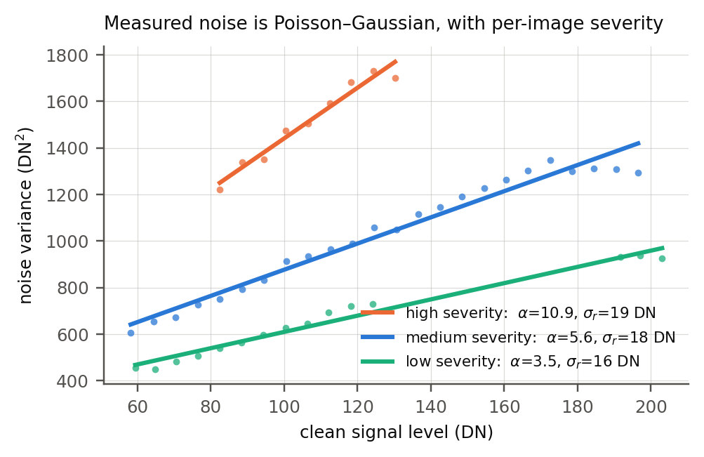
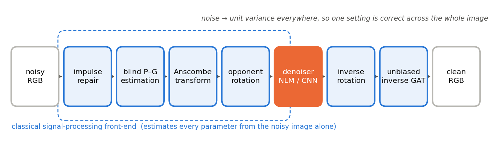
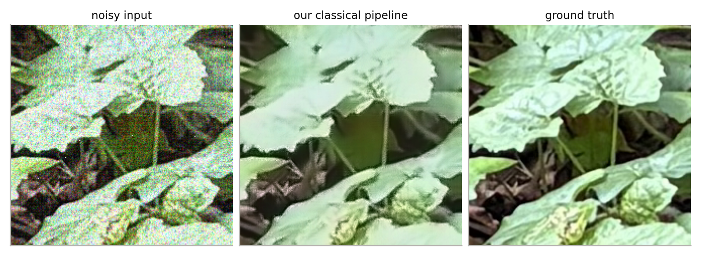

# Falconyx — Low-Light Image Denoising

**Mora SP Cup 2026 · Preliminary Round · University of Sri Jayewardenepura**

A hybrid classical / learned denoiser for images corrupted by low-light sensor
noise. Built measurement-first: we characterised the corruption statistically
before choosing a single filter, and every stage below exists because of
something we measured.

| | Composite score | PSNR gain | SSIM gain | CPU time |
|---|---|---|---|---|
| Provided baseline | 0.2156 | +3.70 dB | +0.1687 | 1.12 s/img |
| Ours — classical only | 0.5053 | +8.42 dB | +0.4236 | 1.02 s/img |
| **Ours — classical + CNN** | **0.5844** | **+9.84 dB** | **+0.4790** | **1.27 s/img** |

*Scored on images 421–460, held out from training, using the organizers'
`evaluation/evaluate.py`. **2.7× the baseline**, and fast enough to run on a
laptop CPU with no GPU.*

---

## Contents

1. [The problem](#1-the-problem)
2. [How we are scored](#2-how-we-are-scored)
3. [What the data told us](#3-what-the-data-told-us)
4. [Pipeline overview](#4-pipeline-overview)
5. [Part A — the classical stages](#5-part-a--the-classical-stages)
6. [Part B — the neural network](#6-part-b--the-neural-network)
7. [Training](#7-training)
8. [Validation strategy](#8-validation-strategy)
9. [Results](#9-results)
10. [What didn't work](#10-what-didnt-work)
11. [Running it](#11-running-it)
12. [Repository layout](#12-repository-layout)
13. [Submission information](#13-submission-information)

---

## 1. The problem

A camera in the dark collects very few photons. What comes back is dominated by
shot noise, read noise, and a scattering of dead pixels. We were given 460
clean/noisy pairs at 992×992 and asked to clean 20 images we would never see the
answers to.

The tempting move is to grab the strongest denoiser available and turn the knob
until the numbers look good. We did something slower first: we measured what was
actually wrong.

## 2. How we are scored

```
ΔPSNR = PSNR(denoised) − PSNR(noisy)
ΔSSIM = SSIM(denoised) − SSIM(noisy)

N = clip(ΔPSNR / 15, 0, 1)
S = max(ΔSSIM, 0)

Score = 0.6·N + 0.4·S
```

The metric rewards *improvement*, not absolute quality — a method that barely
changes the input scores ~0. The 15 dB normaliser means ΔPSNR carries most of
the weight in practice, since realistic gains sit well below the cap. The
provided baseline scores ≈0.26 and a submission must beat it to be ranked.

## 3. What the data told us



**3.1 The images are not darkened.** Regressing noisy on clean over
clipping-safe mid-tones gives a slope of **0.98–1.00** per channel. A naive
whole-image fit *appears* to show contrast compression, but that is entirely an
artefact of clipping at 0 and 255. "Low-light" here means *noisy*, not *dim*.
We therefore apply no brightness or tone correction — any exposure adjustment
actively costs score.

**3.2 The noise is Poisson–Gaussian.** Conditioning the residual on the clean
signal gives

```
Var[n | x] = α·x + σ_r²
```

which is why the plot above is a set of straight lines. α is the photon/shot
gain, σ_r the read noise. The practical consequence is uncomfortable: a filter
tuned for shadows destroys highlights, and one tuned for highlights leaves
shadows noisy. **No single fixed strength is correct anywhere in the image.**

**3.3 Severity varies per image.** Across the public set α ranges **3.5–10.9**
and σ_r **13–22 DN** — roughly a 3× spread. This is the handbook's "different
severity levels". A fixed-parameter filter cannot be right for all 460 images,
so ours measures each one.

**3.4 Three further components.**

| Component | Measurement |
|---|---|
| Row/column stripe noise | per-row and per-column residual means have sd 3–4.6 DN where i.i.d. noise predicts 0.45–0.64 — a 6–8× excess; autocorrelation does not decay from lag 1 to lag 2 |
| Impulse outliers | \|residual\| > 100 DN on 0.03–0.45% of pixels |
| Clipping | up to 31% of pixels pinned at 0 in dark scenes, 7.5% at 255 in bright ones |
| Channel correlation | residual cross-channel correlation only 0.02–0.13 |

That last row matters: the channels are nearly independent, which licenses
treating them separately.

## 4. Pipeline overview



```
noisy RGB (992×992 uint8)
  │
  ├─ 1. impulse / hot-pixel repair          classical
  ├─ 2. blind Poisson–Gaussian estimation   classical   → α, σ_r² per channel
  ├─ 3. Generalised Anscombe Transform      classical   → unit-variance noise
  ├─ 4. orthonormal opponent rotation       classical   → luma / chroma
  │
  ├─ 5. DENOISER  ── residual U-Net         learned
  │                └─ or non-local means    classical  (automatic fallback)
  │
  ├─ 6. inverse opponent rotation           classical
  └─ 7. exact unbiased inverse GAT          classical
  │
clean RGB → <id>.png
```

Nothing in the pipeline reads a filename, an image index, or ground truth. Every
parameter is estimated from the noisy image in front of it.

## 5. Part A — the classical stages

All of this lives in [`scripts/noise_model.py`](scripts/noise_model.py).

### 5.1 Impulse / hot-pixel repair

A pixel is replaced by its 3×3 median when it deviates from that median by more
than 4σ, where σ is a **robust** scale estimate from the median absolute
deviation of the median-residual:

```
σ̂ = MAD / 0.6745
```

Using the MAD rather than a fixed threshold means the test adapts to each
image's noise level automatically — the provided baseline uses a fixed 0.25
threshold, which is too aggressive on noisy images and too lax on clean ones.

**Contribution: +0.018 score.**

### 5.2 Blind Poisson–Gaussian estimation

This is what makes the pipeline adaptive. For each channel:

1. Tile the image into 8×8 blocks and compute the (mean, variance) of each.
2. Bin the blocks by mean intensity.
3. In each bin take the **10th percentile** of the variances. Blocks with image
   structure have inflated variance; the low percentile isolates the flat ones,
   whose variance is noise alone.
4. Least-squares fit `variance = α·mean + σ_r²` across the bins.

The result is α and σ_r² **for this image, from the noisy pixels only**. No
ground truth is involved, so the identical procedure runs at training time and
at inference time.

### 5.3 Generalised Anscombe Transform — the load-bearing idea

```
f(x) = (2/α)·√( α·x + (3/8)·α² + σ_r² )
```

A variance-stabilising transform. It maps signal-dependent Poisson–Gaussian
noise to approximately white Gaussian noise of **unit variance everywhere**.

Two consequences, and both are the reason the rest of the design works:

- One denoiser setting becomes correct across the entire intensity range.
- The learned stage no longer has to model the noise level at all — only image
  structure. That is why a half-million-parameter network is enough, and why
  inference stays fast on a CPU.

### 5.4 Orthonormal opponent-colour rotation

After the GAT each plane carries unit-variance noise, and §3.4 showed the
channels are nearly uncorrelated. An **orthonormal** rotation therefore
preserves that unit variance *exactly* while concentrating structure into luma:

```
        ⎡ 1   1   1 ⎤              luma
  M =   ⎢ 1   0  −1 ⎥  (rows normalised)    red − blue
        ⎣ 1  −2   1 ⎦              red − 2·green + blue
```

Chroma planes are far smoother than luma, so they tolerate — and benefit from —
**3× stronger** smoothing. Denoising R, G and B separately scored 0.297; adding
this rotation took it to **0.379**. It is only valid *because* stage 5.3 came
first.

### 5.5 Non-local means (classical fallback)

For each patch, search the image for patches that look similar and average them.
Noise is random so it cancels; real detail is consistent so it survives. Applied
in the stabilised domain at strength 0.9σ on luma and 2.7σ on chroma — values
found by a sweep (0.75 → 0.418, **0.90 → 0.467**, 1.3 → 0.417).

This path runs automatically whenever PyTorch or the checkpoint is unavailable,
so the script can never fail to produce output.

### 5.6 Exact unbiased inverse GAT

The naive algebraic inverse of the GAT is **biased** — the expectation of the
transform is not the transform of the expectation. We use the closed-form exact
unbiased inverse (Mäkitalo & Foi):

```
I(D) = D²/4 + ¼√(3/2)·D⁻¹ − (11/8)·D⁻² + (5/8)√(3/2)·D⁻³ − 1/8
```

applied in the equivalent-Poisson variable, then rescaled by α and σ_r². Skipping
this correction leaves a systematic intensity error in the output.

## 6. Part B — the neural network

Defined in [`scripts/train.py`](scripts/train.py) as `SmallUNet`.

### 6.1 Architecture

A three-scale residual U-Net operating on the **stabilised, rotated**
representation — not on raw pixels.

| Block | Operation | Channels | Resolution |
|---|---|---|---|
| `enc1` | 2 × (Conv3×3 → ReLU) | 3 → 32 | 1× |
| pool | MaxPool 2×2 | 32 | ½ |
| `enc2` | 2 × (Conv3×3 → ReLU) | 32 → 64 | ½ |
| pool | MaxPool 2×2 | 64 | ¼ |
| `enc3` | 2 × (Conv3×3 → ReLU) | 64 → 128 | ¼ |
| upsample + skip | nearest ×2, concat `enc2` | 128+64 = 192 | ½ |
| `dec2` | 2 × (Conv3×3 → ReLU) | 192 → 64 | ½ |
| upsample + skip | nearest ×2, concat `enc1` | 64+32 = 96 | 1× |
| `dec1` | 2 × (Conv3×3 → ReLU) | 96 → 32 | 1× |
| `out` | Conv3×3 | 32 → 3 | 1× |

**472,387 parameters (0.47M).** Effective receptive field ≈ **43 px**.

### 6.2 Design choices, and why

**It predicts the residual, not the image.** The final operation is

```python
return x - self.out(d1)
```

so the network outputs the *noise* to subtract. With the output layer near zero
the whole model starts as an identity mapping, which trains far faster on a
small dataset — the network never has to learn to reconstruct the image, only to
spot what is wrong with it.

**Three scales.** Noise is local but the *evidence* for what is signal and what
is noise is not — a texture repeated across 40 pixels is signal. Three scales
give a 43 px receptive field at a fraction of the cost of achieving that depth at
full resolution.

**Width 32.** Chosen for CPU inference. 0.47M parameters denoise a 992×992 image
in 1.27 s on an i5 with no GPU. A wider model scored no better in our tests and
would have jeopardised the runtime marks.

**Skip connections.** The encoder discards spatial precision when pooling; the
skips return it, so edges stay sharp rather than being reconstructed from a
coarse representation.

**It never sees raw pixels.** Because the front-end has already equalised the
noise, the network only has to learn what images look like. This is the single
biggest reason a model this small is sufficient.

### 6.3 Inference

The image is processed in **496×496 tiles with 32 px overlap**, and the overlap
is cropped away so tile boundaries leave no seam. This bounds peak memory on a
modest CPU. If PyTorch or `model.pt` is missing, `load_model()` returns cleanly
and the classical path runs instead.

## 7. Training

| | |
|---|---|
| Training images | 001–420 (420 images) |
| Held out | 421–460 (40 images), never trained on |
| Patches | 24 random 128×128 crops per image per epoch |
| Augmentation | dihedral — 4 rotations × 2 flips |
| Epochs | 40 (≈403,200 patch presentations) |
| Batch size | 16 |
| Optimiser | AdamW, lr 2×10⁻⁴, weight decay 10⁻⁴ |
| Schedule | cosine annealing |
| Loss | Charbonnier, ε = 10⁻³ |
| Precision | mixed (AMP) |
| Seed | 2026, fixed throughout |
| Hardware | NVIDIA RTX 2050 4 GB, ≈30 minutes |

**Why Charbonnier rather than L2?** `√((pred−target)² + ε²)` behaves like L2 for
small errors and like L1 for large ones, so it is robust to the outliers left by
clipping at 0 and 255 — of which there are many in this dataset.

**The front-end is cached.** It is deterministic, so running it every epoch would
be waste. `train.py` applies it once per image and stores the result as a float16
memory-map on disk (~5 GB), which keeps RAM usage near zero while still allowing
a fresh random crop from anywhere in the image on every sample.

## 8. Validation strategy

Images **001–420** train. Images **421–460** are held out and never trained on —
every number in this README comes from them. Images 461–480 have no ground truth
and were never used for any fitting or tuning.

This matters because a network can memorise. Scoring on images it trained on
would not predict behaviour on the submission set, whereas the held-out 40 are,
from the model's point of view, exactly as unfamiliar as 461–480.

`scripts/validate.py` scores the baseline, the classical pipeline and the hybrid
on that split using the organizers' exact metric, so the comparison is
like-for-like.

## 9. Results

**Held-out split (421–460):**

| Method | Score | ΔPSNR | ΔSSIM | CPU s/img |
|---|---|---|---|---|
| Provided baseline | 0.2156 | +3.70 dB | +0.1687 | 1.12 |
| Classical only | 0.5053 | +8.42 dB | +0.4236 | 1.02 |
| **Hybrid (submitted)** | **0.5844** | **+9.84 dB** | **+0.4790** | **1.27** |

**Absolute reconstruction quality**, full 460-image public set: noisy inputs sit
at 19.83 dB / 0.464 SSIM; our classical output reaches **26.95 dB / 0.819 SSIM**,
and the hybrid gains a further 1.4 dB. An SSIM of 0.82 means the reconstruction
shares most of its local structure with the original — edges, shapes and shading
recovered — while the finest low-contrast texture is not fully recoverable once
buried under noise of this strength.

> Note: the classical pipeline scores 0.427 over all 460 images but 0.505 on
> 421–460. That subset is slightly easier than average, so comparisons are only
> ever made *within* a split.



**Ablation** (20-image development sample, full resolution):

| Configuration | Score | ΔPSNR |
|---|---|---|
| Provided baseline | 0.303 | +3.9 |
| Per-channel GAT + NLM, no colour rotation | 0.297 | +4.3 |
| Plain NLM h=20, raw domain | 0.371 | +5.8 |
| + opponent rotation, with destriping | 0.379 | +5.5 |
| **+ opponent rotation, destriping off** | **0.467** | **+7.6** |
| destriping off, impulse repair off | 0.449 | +7.3 |

## 10. What didn't work

Three ideas we implemented, measured, and rejected. Knowing *why* something fails
on this data is worth as much as knowing what wins.

**Destriping — cost 0.088 score and 2.1 dB.** The stripe noise is real and
statistically unambiguous (§3.4), and we built a robust row/column estimator on
the high-pass residual. But subtracting a row profile also removes genuine
content wherever a scene has strong horizontal or vertical structure — a horizon,
a building edge. On this dataset that loss exceeds the stripe energy recovered.
The code remains in `noise_model.py`, disabled by default.

**BM3D — slower and worse.** Applied in the stabilised domain its score peaked at
σ = **exactly 1.0** (0.7 → 0.260, 1.0 → 0.319, 1.3 → 0.302). That the optimum
lands precisely at unity is independent confirmation that our blind noise
estimation and variance stabilisation are correctly calibrated — a useful result
in itself. We dropped it anyway: ~130 s/image against 1.1 s, for a lower score.

**Training twice as long — better loss, worse model.** 80 epochs instead of 40
cut the training loss 11% (0.2350 → 0.2097) but *lowered* the held-out score
(0.5844 → 0.5798). The longer run had started fitting the training images rather
than the task. Choosing on training loss would have shipped the weaker model; the
held-out split caught it.

Also evaluated and rejected: BayesShrink wavelet thresholding (0.262), bilateral
filtering (0.285).

## 11. Running it

```bash
pip install -r scripts/requirements.txt

python scripts/denoise.py \
    --noise_dir    competition_data/submissions/noisy \
    --denoised_dir competition_data/submissions/denoised
```

`--input_dir` / `--output_dir` are accepted as aliases. The script performs the
required `<id>_noise.png → <id>.png` rename itself and never modifies the
provided inputs.

CPU-only by default, fully offline, all seeds fixed at 2026 — the submitted code
regenerates the submitted images exactly.

Useful flags: `--cpu` forces CPU even with a GPU present; `--classical` forces
the classical path; `--strength S` sets the classical denoiser strength.

<details>
<summary><b>Reproducing everything from scratch</b></summary>

```bash
# 1. dataset into the required layout (copies only, no renaming)
python scripts/setup_data.py --downloads <folder with the 3 dataset folders>

# 2. train the learned stage (001-420; 421-460 held out)
python scripts/train.py --data_root competition_data/public

# 3. generate the submission
python scripts/denoise.py --noise_dir competition_data/submissions/noisy \
                          --denoised_dir competition_data/submissions/denoised

# 4. honest self-evaluation on the held-out split
python scripts/validate.py
```

Step 2 builds a ~5 GB cache on first run and reuses it afterwards.
</details>

## 12. Repository layout

```
baseline/            provided, unmodified
evaluation/          provided, unmodified
competition_data/
  submissions/
    noisy/           461_noise.png … 480_noise.png
    denoised/        461.png … 480.png      ← our outputs
scripts/
  denoise.py         required entry point
  noise_model.py     classical stages 1-4 and 6-7
  train.py           network definition and training
  validate.py        held-out scoring
  setup_data.py      dataset layout helper
  model.pt           trained network (40 epochs) — submitted
  requirements.txt
  README.md          run instructions, commit SHA, checksums
docs/                figures used by this README
```

All our code lives in `scripts/`, as the handbook requires; nothing in
`baseline/`, `evaluation/` or the provided data has been modified.

The public 460-image dataset is deliberately not committed: the dataset terms
forbid redistributing or publicly mirroring it. `scripts/setup_data.py` puts it
in place from your own copy.

## 13. Submission information

| | |
|---|---|
| Team | **Falconyx** |
| Git commit SHA | `a246fb2abd1216b91eac325b902ce7fd6631b2b7` |
| Model checkpoint | `scripts/model.pt` (committed directly, 1.9 MB) |
| Model SHA-256 | `f5ed44cb5ccc30aa2db7a54d3a72caffe8faf23db40cab8769efb289565ebae3` |

**The commit SHA above is the official submitted code version.** It is the
commit that produced every number in this README and every image in
`competition_data/submissions/denoised/`.

A note on self-reference: a file cannot record the identifier of the commit
that adds it, because writing the identifier changes it. The commit named
above therefore contains the complete solution, and the single commit that
follows it — the tip of `main` — changes nothing but these two identifier
lines. Both are tagged (`git tag`), so either can be checked out directly.
Nothing executable differs between them; `git diff a246fb2 HEAD`
touches only `README.md` and `scripts/README.md`.

> **Submission freeze.** No commits may be made to this repository after the
> preliminary-round deadline, and the checkpoint must not be modified or
> replaced.

---

*IEEE Signal Processing Society · Mora SP Cup 2026*
